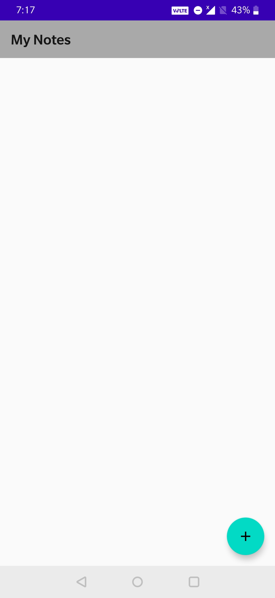
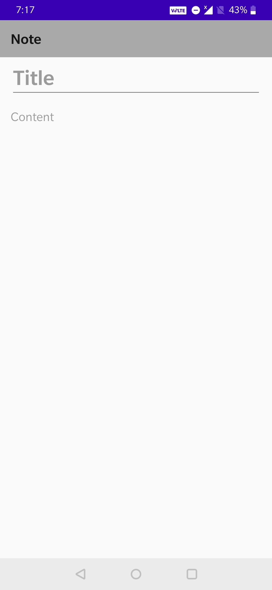
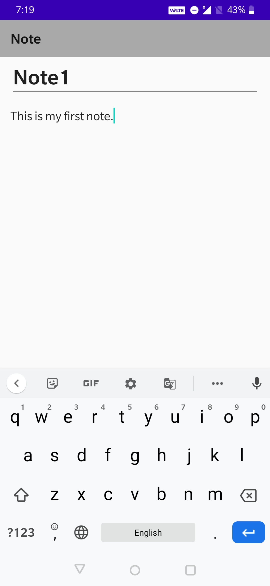
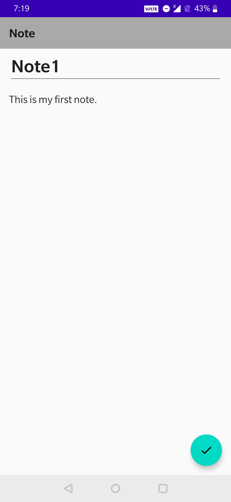
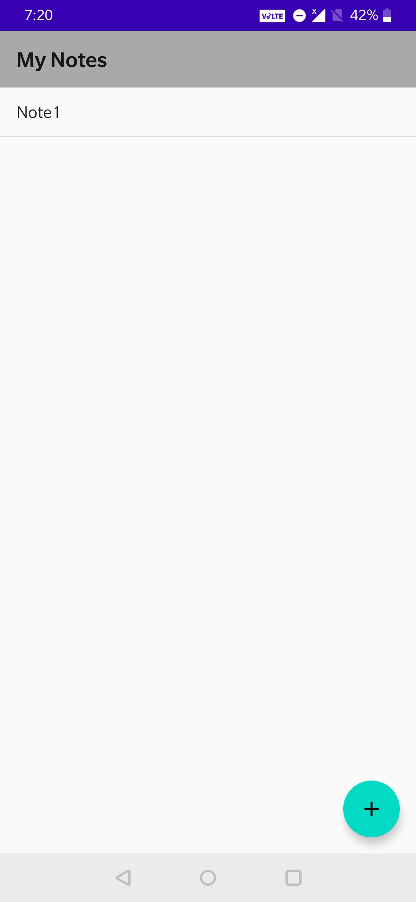
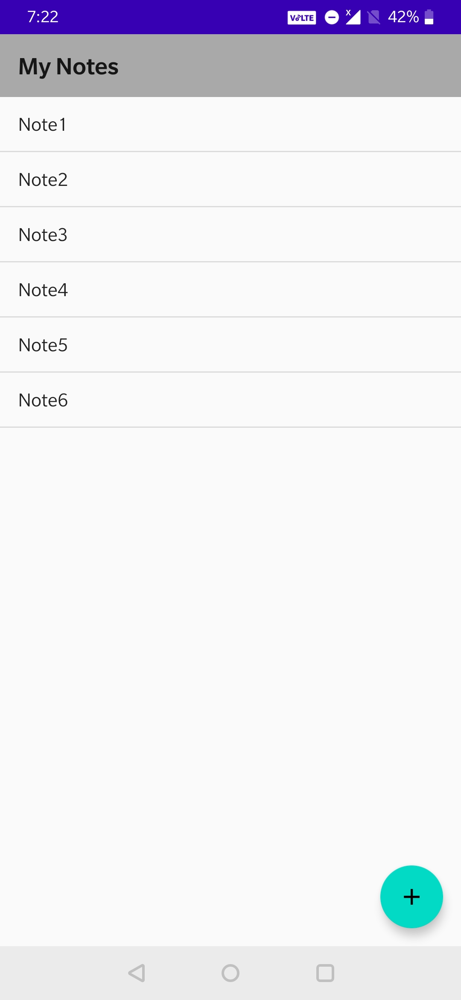
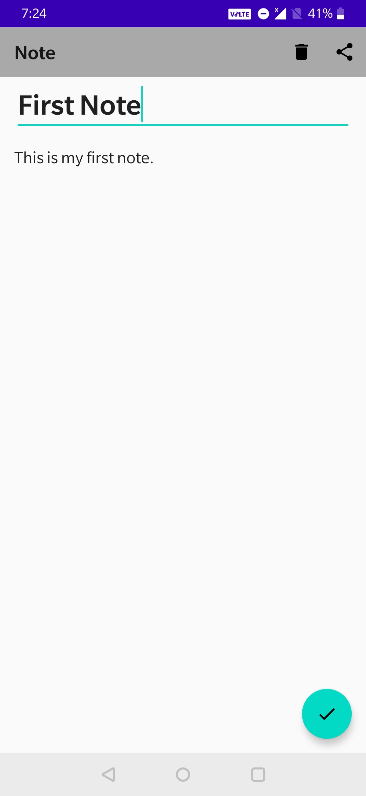
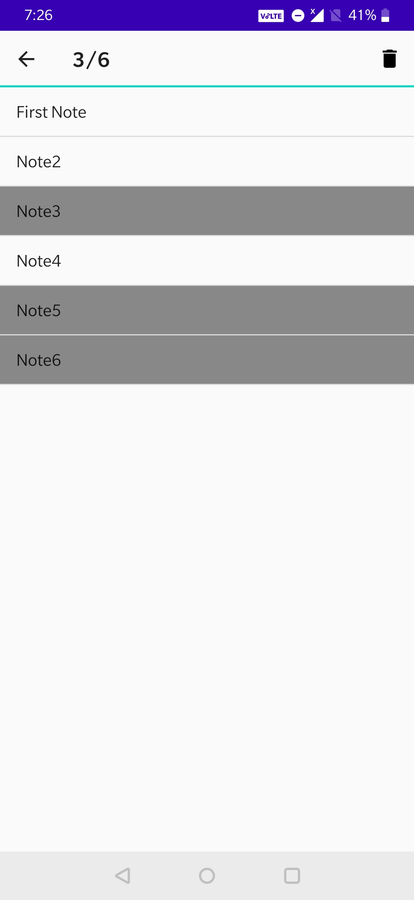
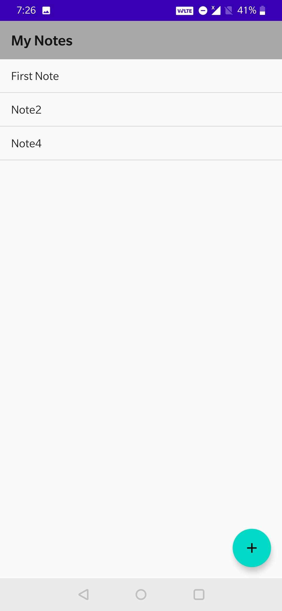
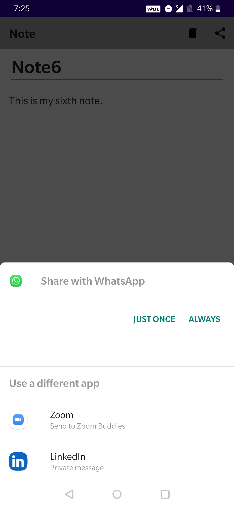

# Android Application to save and maintain Notes

#### Adding Note

&nbsp;&nbsp;&nbsp;&nbsp;&nbsp;&nbsp;&nbsp;&nbsp;&nbsp;&nbsp;&nbsp;&nbsp;
    
&nbsp;&nbsp;&nbsp;&nbsp;&nbsp;&nbsp;&nbsp;&nbsp;&nbsp;&nbsp;&nbsp;&nbsp;

#### All Notes

#### Edit a Note

&nbsp;&nbsp;&nbsp;&nbsp;&nbsp;&nbsp;&nbsp;&nbsp;&nbsp;&nbsp;&nbsp;&nbsp;

#### Select multiple Notes and Delete

&nbsp;&nbsp;&nbsp;&nbsp;&nbsp;&nbsp;

#### Share a Note

&nbsp;&nbsp;&nbsp;&nbsp;&nbsp;&nbsp;
